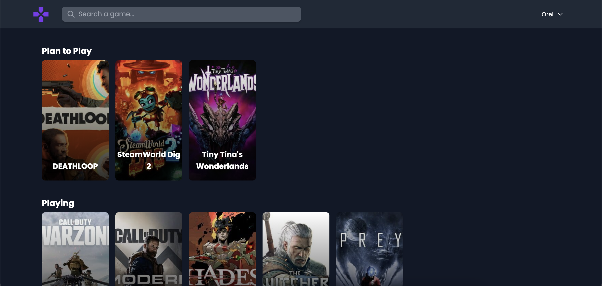
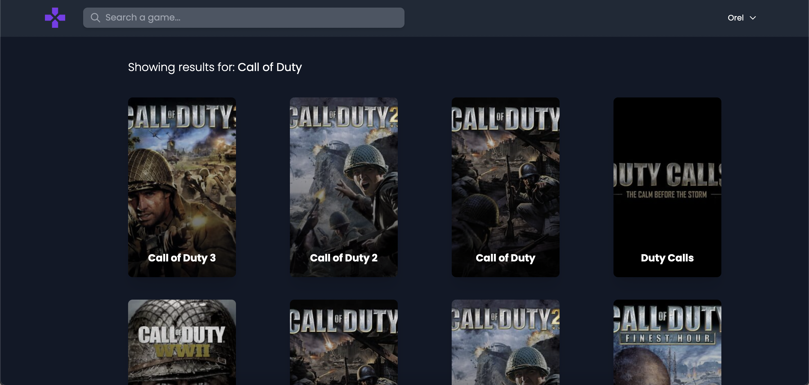
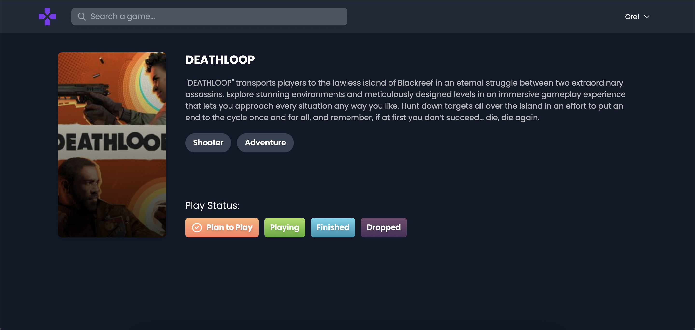

# 🎮 Plan to Play

This is a web app that helps you manage your library and backlog of video games. You can use it to track the games you play, plan to play, finished, and dropped.

Technologies used:

- Server: Node.js, Express, Knex, PostgreSQL
- Client: React, Redux, Tailwind

## Photos

## Behind the scenes

The server requests an access token from Twitch and caches it in memory alongside its expiration date to avoid excessive access token requests.

When a user signs up, it uses bcrypt to generate a salt in 10 rounds, and hashes the password before saving it to the database. It then signs a JWT and passes it to the client in an HttpOnly cookie.

The database has an intemediate `users_games` table to store the many-to-many relationship between games and lists of users. The list is an enum.

---

## Steps to run

First, you need to create an app in the Twitch developers website and supply the app with the client ID and client sercret (`.env` if you deploy manually or the `environment` section in the docker-compose file).

### Manually

Consult the readme files in both `server` and `client`.

### Docker

Copy `docker-compose.yml.example` to `docker-compose.yml` and update the values in `<>` accordingly.

Run `docker-compose up -d`

Connect to the server container's CLI and run `yarn run knex migrate:latest`. This creates the needed tables in the database.
